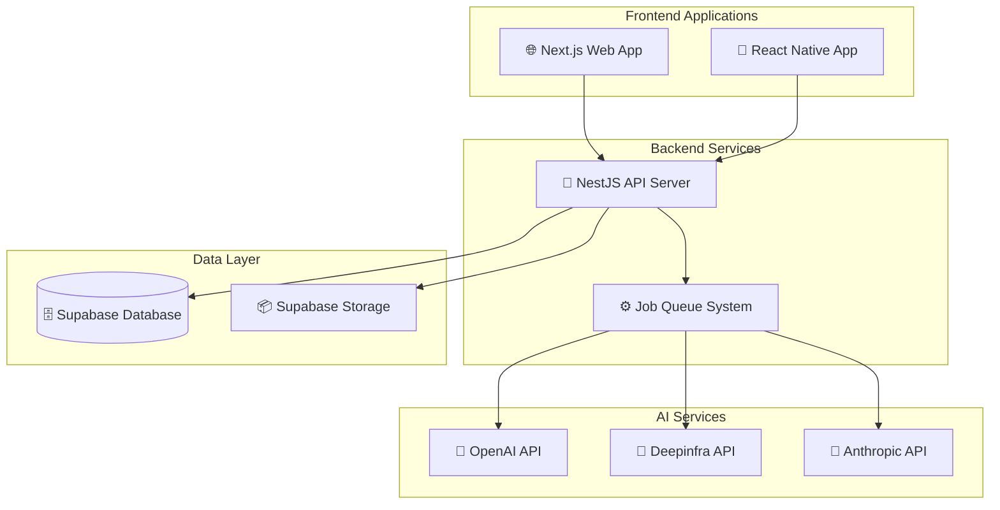

<div align="center">

# 🎓 Build Your Own PhD

### *Transform any content into your personal PhD curriculum*

[](https://opensource.org/licenses/MIT)
[](https://www.typescriptlang.org/)
[](https://reactjs.org/)
[](https://reactnative.dev/)
[](https://nestjs.com/)
[](https://supabase.com/)

*🚀 Upload any content → 🤖 AI processes it → 📱 Read/Listen anywhere*

</div>

---

## 🌟 Overview

**buildyourownphd.com** is an AI-powered platform that transforms any educational content into a structured, accessible learning experience. Upload PDFs, videos, articles, or audio files, and watch as our AI converts everything into beautiful markdown documentation with generated audio narration.

Perfect for researchers, students, autodidacts, and lifelong learners who want to organize and consume knowledge efficiently across all their devices.

### ✨ Key Features

🎯 **Smart Content Processing**
- 📄 Extract text from PDFs with formatting preservation
- 🎵 Transcribe audio and video content automatically
- 🔗 Convert web articles and documents
- 🤖 AI-powered summarization and organization

📚 **Intelligent Organization**
- 🗂️ Project-based content management
- 📖 Chapter and module organization
- 🏷️ Automatic tagging and categorization
- 🔍 Powerful search and filtering

🎧 **Multi-Modal Consumption**
- 📖 Beautiful markdown rendering
- 🔊 High-quality text-to-speech audio
- 📱 Mobile-optimized reading experience
- 🎵 Advanced audio player with bookmarks

🌐 **Cross-Platform Sync**
- 💻 Responsive web application
- 📱 Native mobile app (iOS/Android)
- ☁️ Real-time synchronization
- 📴 Offline reading and listening

---

## 🏗️ Architecture

<div align="center">



</div>

### 🛠️ Tech Stack

**Frontend**
- **Web**: Next.js 14, TypeScript, TailwindCSS, Shadcn UI
- **Mobile**: React Native (Expo), TypeScript, react-native-markdown-display
- **State Management**: Zustand, React Query, WebSocket integration

**Backend**
- **API Server**: NestJS, TypeScript, Express
- **Database**: Supabase (PostgreSQL)
- **Storage**: Supabase Storage
- **Queue**: Redis-based job processing

**AI & Processing**
- **Text Extraction**: OpenAI GPT-4 Vision, PDF processing
- **Transcription**: Deepinfra, Anthropic Claude
- **Text-to-Speech**: OpenAI TTS, ElevenLabs
- **Content Processing**: Custom markdown standardization

**DevOps & Testing**
- **Testing**: Playwright, Jest, React Testing Library
- **Deployment**: Railway, Docker
- **Monitoring**: Comprehensive error tracking and analytics
- **CI/CD**: GitHub Actions, automated testing

---

## 🚀 Quick Start

### Prerequisites

- Node.js 18+ and npm
- Git
- Supabase account
- OpenAI API key

### 1. Clone the Repository

```bash
git clone https://github.com/your-username/buildyourownphd.git
cd buildyourownphd
```

### 2. Install Dependencies

```bash
npm install
```

### 3. Environment Setup

Copy the environment template and configure your services:

```bash
cp env.example .env.local
```

Edit `.env.local` with your API keys:

```env
# Supabase
NEXT_PUBLIC_SUPABASE_URL=your_supabase_url
NEXT_PUBLIC_SUPABASE_ANON_KEY=your_supabase_anon_key
SUPABASE_SERVICE_ROLE_KEY=your_service_role_key

# OpenAI
OPENAI_API_KEY=your_openai_api_key

# Deepinfra
DEEPINFRA_API_KEY=your_deepinfra_api_key

# Other services...
```

### 4. Database Setup

```bash
# Set up Supabase database schema
npm run db:setup

# Run migrations
npm run db:migrate
```

### 5. Start Development Servers

```bash
# Start all services in parallel
npm run dev

# Or start individually:
npm run dev:web      # Web app on http://localhost:3000
npm run dev:mobile   # Mobile app (Expo)
npm run dev:backend  # API server on http://localhost:8000
```

---

## 📱 Usage

### Web Application

1. **Sign up** at `http://localhost:3000`
2. **Create a project** for your learning topic
3. **Upload content**: Drag and drop files or paste URLs
4. **Wait for processing**: AI extracts and converts content
5. **Organize**: Arrange content into chapters and modules
6. **Study**: Read markdown or listen to generated audio

### Mobile App

1. **Download** the Expo app and scan the QR code
2. **Sign in** with your account
3. **Sync** your content automatically
4. **Read offline** with beautiful markdown rendering
5. **Listen anywhere** with background audio playback

---

## 🔧 Development

### Project Structure

```
buildyourownphd/
├── apps/
│   ├── web/                 # Next.js web application
│   ├── mobile/              # React Native mobile app
│   └── backend/             # NestJS API server
├── packages/
│   ├── ui/                  # Shared UI components
│   └── utils/               # Shared utilities
├── docs/                    # Documentation
└── scripts/                 # Development scripts
```

### Available Scripts

```bash
# Development
npm run dev                  # Start all services
npm run dev:web             # Web app only
npm run dev:mobile          # Mobile app only  
npm run dev:backend         # Backend only

# Building
npm run build               # Build all applications
npm run build:web           # Build web app
npm run build:mobile        # Build mobile app

# Testing
npm run test                # Run all tests
npm run test:e2e            # Run Playwright E2E tests
npm run test:unit           # Run unit tests

# Database
npm run db:setup            # Initial database setup
npm run db:migrate          # Run migrations
npm run db:seed             # Seed test data
```

### Testing

We use a comprehensive testing strategy:

- **Unit Tests**: Jest + React Testing Library
- **Integration Tests**: API endpoint testing
- **E2E Tests**: Playwright with Microsoft Playwright Testing Service
- **Mobile Tests**: Detox for React Native

```bash
# Run specific test suites
npm run test:unit           # Unit tests
npm run test:integration    # Integration tests
npm run test:e2e           # End-to-end tests
npm run test:mobile        # Mobile app tests
```

---

## 🤝 Contributing

We welcome contributions! Please see our [Contributing Guide](CONTRIBUTING.md) for details.

### Development Workflow

1. **Fork** the repository
2. **Create** a feature branch: `git checkout -b feature/amazing-feature`
3. **Make** your changes with tests
4. **Test** your changes: `npm run test`
5. **Commit** with conventional commits: `git commit -m 'feat: add amazing feature'`
6. **Push** to your branch: `git push origin feature/amazing-feature`
7. **Submit** a Pull Request

### Code Style

- **TypeScript** for all new code
- **ESLint + Prettier** for formatting
- **Conventional Commits** for commit messages
- **Jest** for unit tests
- **Playwright** for E2E tests

---

## 📋 Roadmap

### Phase 1: Foundation ✅
- [x] Monorepo setup with Turborepo
- [x] Authentication and user management
- [x] Basic file upload and storage

### Phase 2: Core Processing 🚧
- [x] AI content extraction and processing
- [x] Job queue system for async processing
- [ ] Content quality validation and optimization

### Phase 3: Enhanced UX 📅
- [ ] Advanced content organization features
- [ ] Collaborative editing and sharing
- [ ] Advanced audio features (chapters, bookmarks)

### Phase 4: Platform Expansion 🔮
- [ ] Browser extension for web clipping
- [ ] API for third-party integrations
- [ ] Enterprise features and SSO

---

## 📄 License

This project is licensed under the MIT License - see the [LICENSE](LICENSE) file for details.

---

## 🙏 Acknowledgments

- **OpenAI** for GPT-4 and TTS capabilities
- **Supabase** for backend infrastructure
- **Vercel** for Next.js framework
- **Expo** for React Native development
- **Railway** for deployment platform

---

<div align="center">

### 🌟 Star this repository if you find it helpful!

**[🚀 Live Demo](https://buildyourownphd.com)** • **[📖 Documentation](https://docs.buildyourownphd.com)** • **[💬 Discord](https://discord.gg/buildyourownphd)**

*Built with ❤️ for lifelong learners everywhere*

</div> 